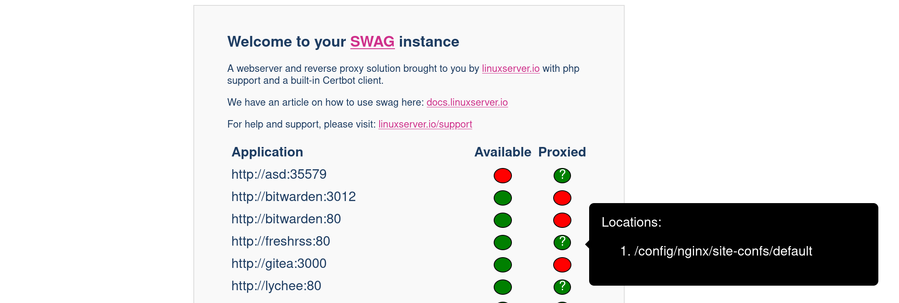

# SWAG status mod

This mod adds a status page which shows available and proxied applications based on SWAG's sample proxy-confs, the page is only available locally.

The status page is available under `http://<your-domain>/status`.

In SWAG's docker arguments, set an environment variable DOCKER_MODS=ghcr.io/quietsy/swag-status-mod:latest

If adding multiple mods, enter them in an array separated by |, such as DOCKER_MODS=ghcr.io/quietsy/swag-status-mod:latest|ghcr.io/linuxserver/mods:some-other-mod

## Example
